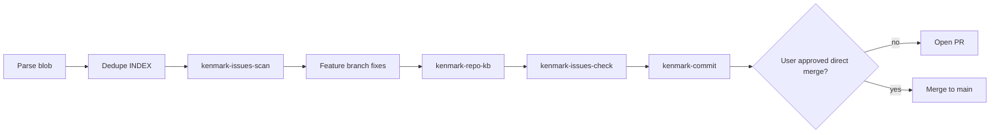

# Fix-and-ship workflow phases

## Sequence

## Per-issue fix loop

1. Read issue `files:` and Evidence section.
2. Search codebase to confirm the bug still exists.
3. Apply minimal fix; avoid unrelated refactors.
4. Update KB if behavior, API, schema, auth, UI, deploy, or workflow changed.
5. Re-run targeted checks before moving to the next issue.

## When to pause

- INDEX ledger disagrees with folders → `kenmark-issues-maintain`
- Protected branch with no user override → create feature branch
- Ambiguous grouping for commits → ask user (high stakes only)
- Decryption/auth failures in agent runs → verify `ENCRYPTION_KEY` is identical in web and worker env
