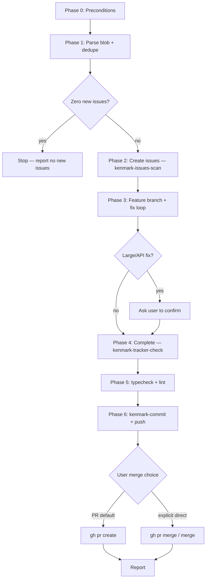

# Fix-and-ship workflow phases

Detailed step-by-step for `kenmark-issues-fix-and-ship`. The orchestrator loads sibling skills; this file is the execution checklist.

## Sequence



## Phase 1 — Parse blob

### Input formats

The blob may be:

- Bullet list of bugs or gaps
- Pasted scan output from another agent
- Free-form paragraph describing multiple issues
- Structured table (title | file | severity)

### Parsing rules

1. One candidate issue per distinct bug, gap, or inconsistency.
2. Extract: title (imperative or symptom), evidence paths, severity hint, suggested fix.
3. Slug candidates are lowercase-hyphen (no numbers in slug).

### Dedupe checks

Before assigning IDs, compare each candidate against:

| Source | Check |
| --- | --- |
| `brain/issues/*.md` | Same `files:` primary path + same symptom |
| `brain/issues/completed/*.md` | Same pattern already fixed |
| `INDEX.md` tables | Title similarity |

Skip candidates that match an existing issue. Log skipped items in the report.

### Stop gate

```text
unique_candidates == 0 → STOP
```

Report: "Blob produced zero new issues after dedupe." Do not branch, fix, or commit.

---

## Phase 2 — Create issues

Follow `kenmark-issues-scan` Steps 1, 5, and 6.

### ID assignment

```bash
ISSUES_DIR="$(git rev-parse --show-toplevel)/brain/issues"
# Collect IDs from INDEX + active + completed (see kenmark-issues-scan Step 1)
NEXT_ID="$(printf "%03d" "$((10#$LAST_ID + 1))")"
```

### Issue file template

```markdown
---
id: {next-id}
title: {concise one-liner}
severity: P0|P1|P2
area: frontend|backend|api|...
source: kenmark-issues-fix-and-ship
status: open
created: {YYYY-MM-DD}
files:
  - path/to/file
---

## Summary
...

## Evidence
- `file:line` — finding

## Suggested fix
...

## Acceptance criteria
- [ ] criterion
```

### INDEX updates

1. Set `Last Assigned ID` to highest assigned this run.
2. Set `Next ID` to `Last Assigned ID + 1` (3-digit zero-padded).
3. Increment active count; add rows to P0/P1/P2 tables.

---

## Phase 3 — Fix loop

### Branch decision

Output before editing code:

```text
Current branch: main
Branch assessment: protected — production CI/CD
Decision: git switch -c fix/issue-NNN-slug
```

### Priority order

1. All P0 issues
2. All P1 issues
3. All P2 issues

Within the same priority, sort by ID ascending.

### Per-issue steps

1. Mark `status: in-progress` in issue frontmatter (optional).
2. Read `files:` and Evidence.
3. Confirm bug still exists (`grep`, `Read`).
4. Apply minimal fix — no unrelated refactors.
5. Update `brain/kb/` when required (see `kenmark-commit` Brain KB check).
6. Run targeted checks:

| Repo signal | Command |
| --- | --- |
| `package.json` has `typecheck` | `pnpm typecheck` |
| `package.json` has `lint` | `pnpm lint` |
| Tests exist for touched module | `pnpm test -- <filter>` or full `pnpm test` |

7. Move to next issue.

### Pause gates

| Condition | Action |
| --- | --- |
| >8 unrelated file paths in one fix | Ask user to confirm |
| Public API change (routes, exports, env) | Ask user to confirm |
| INDEX ledger drift | Run `kenmark-tracker-maintain` |
| Decryption/auth failures in agent runs | Verify `ENCRYPTION_KEY` identical in web and worker env |

---

## Phase 4 — Complete issues

For each fixed issue:

```bash
mv brain/issues/042-slug.md brain/issues/completed/042-slug.md
```

Edit frontmatter:

```yaml
status: completed
completed: YYYY-MM-DD
```

Update `INDEX.md`:

- Remove from active P0/P1/P2 table
- Add to Completed table with date
- Decrement active count; increment completed count
- Never decrement `Last Assigned ID`

---

## Phase 5 — Pre-commit validation

Run before `kenmark-commit`:

```bash
pnpm typecheck
pnpm lint
# pnpm test — when applicable
```

If validation fails, fix or report — do not commit broken state unless user explicitly waives.

---

## Phase 6 — Commit and push

Delegate to `kenmark-commit`:

1. Branch safety (already done in Phase 3).
2. Group commits by area.
3. Include `brain/` in same push batch.
4. Verify `git log -1 --format=%B` has no trailers.
5. `git push -u origin HEAD` when needed.

---

## Phase 7 — Merge

Default: PR only. See `merge-safety.md`.

Ask every time:

```text
How should we ship?
A) Open PR (recommended)
B) Merge PR to default branch after CI
C) Direct merge — I understand CI/CD may run
```

---

## When to pause (summary)

| Trigger | Skill / action |
| --- | --- |
| INDEX disagrees with folders | `kenmark-tracker-maintain` |
| Protected branch, no override | Create feature branch |
| Zero new issues from blob | Stop |
| Ambiguous commit grouping | `AskUserQuestion` |
| Large or API-breaking fix | Confirm with user |
| Behavioral code change | `kenmark-kb-sync` |
